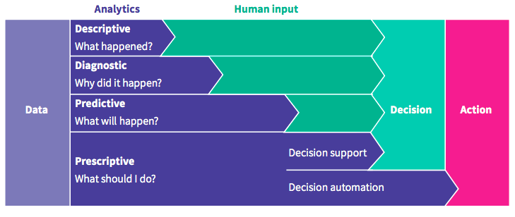

# Production Line Analysis 

## Overview
A production line is a set of sequential operations established in a factory where components are assembled to make a finished article or where materials are put through a refining process to produce an end-product that is suitable for onward consumption (Source [Wikipedia](https://en.wikipedia.org/wiki/Production_line) )

## Use of Data Science  
Data Science/Analysis can be used to perform many types of analysis in Production line processes
1) Descriptive Analysis: What happened?
2) Diagnostic Analysis: Why did this happen?
3) Predictive Analysis: what is likely to happen in the future?
4) Prescriptive Analysis: what to do to get the desired results?

Source(s)
- [Charito.com](https://chartio.com/learn/data-analytics/types-of-data-analysis/)
- [CareerFoundry.com](https://careerfoundry.com/en/blog/data-analytics/different-types-of-data-analysis/)

Image 1: Types of Data Analysis (Source - [Principa](www.principa.co.za))

The ultimate aim would be automation (using real-time analysis and decision making)

Image 2: What we would like to happen eventually (Source - [datajourney.akvo.org](https://datajourney.akvo.org/blog/the-four-types-of-data-analysis))

## POA
1. Understand the What - What is happening now, what is required from the analysis 
2. Understand the Why from the Customers and quantify the Why in terms of $$$
3. Work on the How and show how it ties with the What, using why to help them make the emotional decision.

## Purpose of this Analysis
In this analysis we will focus on the quality of a output from a production line. We will run analysis 1, 2, and 3 and will try to perform Analysis 4 so that the quality can be increased.

### Step 1: Choosing a dataset for analysis
Two datasets that I found useful for analysis are
1) https://www.kaggle.com/alexkaggle95/production-quality-prediction-mae-6-954/#data
2) https://www.kaggle.com/paresh2047/uci-semcom

## Other links that I found useful

| # | Category | Description | URL |
| --- | --- | --- | --- |
| 1 | ML Application | ML applications in production lines: A systematic literature review  | https://www.sciencedirect.com/science/article/pii/S036083522030485X  | 
| 2 | Bakery Process | Bakery Process | https://www.winspc.com/wp-content/uploads/2018/06/Quality-on-the-Rise-in-Bakery-Manufacturing.pdf | 
| | Presenting results | Whitepaper | https://www.intel.com/content/dam/www/public/us/en/documents/white-papers/increase-product-yield-and-quality-with-machine-learning-paper.pdf | 
| | Presenting results | GitHub | https://github.com/liamculligan/bosch-production-line-performance | 
| | Dataset | Focusing on machine maintenance | https://www.kaggle.com/inIT-OWL/versatileproductionsystem | 
| | Dataset | Bosch on Kaggle | https://www.kaggle.com/c/bosch-production-line-performance/overview | 
| | Data Analysis in Manufacturing | Quality Prediction and Yield Improvement in Process Manufacturing Based on Data Analytics | https://www.mdpi.com/2227-9717/8/9/1068/htm | 
