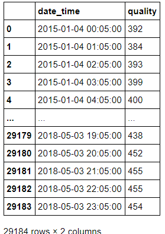

# Production Line Analysis 

## Overview
A production line is a set of sequential operations established in a factory where components are assembled to make a finished article or where materials are put through a refining process to produce an end-product that is suitable for onward consumption (Source [Wikipedia](https://en.wikipedia.org/wiki/Production_line) )

## Use of Data Science  
Data Science/Analysis can be used to perform many types of analysis in Production line processes

Image 1: Types of Data Analysis (Source - [Principa](www.principa.co.za))

***Ultimate aim would be automating the process (using real-time analysis and decision making)***

Image 2: What we would like to eventually happen (Source - [datajourney.akvo.org](https://datajourney.akvo.org/blog/the-four-types-of-data-analysis))

---
## Project: Plan of Action

Dry Run 
1. Choose a test dataset closely resembling real data
2. Do the first 2 types of analysis (Descriptive/Diagnostic)
3. Work on the next 2 types of analysis (Predective and Prescriptive)
4. Present the analysis

Actual Run
1. Understand the What - What is happening now, what is required from the analysis 
2. Understand the Why and quantify the Why in terms of $$$
3. Work on the How (all 4 analysis) and show how it ties with the What, using Why to help them make the emotional decision.
4. Focus on Good Presentation and POC
5. For future implementation, suggest ML to automatically detect undesired quality output using image classification/detection

---

### Choosing a dataset for analysis
Two relevant datasets that were found
#### DATASET 1: [Production Quality Prediction](https://www.kaggle.com/alexkaggle95/production-quality-prediction-mae-6-954)

    +ves
    - Data related to Food production (Coffee roasting)
    - Use of temperature and moisture measurements, raw materials pass through the kiln in an hour.

    Challanges
    - The Target/Outcome (qualities) values are in the range of 221 to 505, and not pass/fail.
    - The rows of Target variables (29,184) is less than the rows of input rows (2,103,841)

    Overcoming Challanges
    - We can convert output values to pass/fail (as a percentage of total results, for example top 80 % as pass, others as fail)
    - We can find a way to have the number of map the input variables and output variables so that the total number of rows match
[Extracting data using pandas](https://github.com/Govind-Patwal/production_line_analysis/blob/main/code/Production_Quality_Prediction.ipynb)

Image 3: df_X

Image 4: df_Y

#### DATASET 2: [UCI SECOM Dataset](https://www.kaggle.com/paresh2047/uci-semcom)
    +ves
    - Data has target values as Pass/Fail
    - Many variables, number of columns = 592 
    - The file has both the input and output values

    Challanges
    - The Columns are only numbered, and not named, so we do not exactly know what does a column mean 

    Overcoming Challanges
    - In real world, the variables can always be named in the file (or mapped with the numbers later)

[Extracting data using pandas](https://github.com/Govind-Patwal/production_line_analysis/blob/main/code/UCI_SECOM_Dataset.ipynb)

Image 5: UCI dataset

---

## Other links that I found useful

| # | Category | Description |
| --- | ---  | --- | 
| 1 | Article | [ML applications in production lines: A systematic literature review](https://www.sciencedirect.com/science/article/pii/S036083522030485X)  |
| 2 | Article | [Quality on the rise in bakery manufacturing](https://www.winspc.com/wp-content/uploads/2018/06/Quality-on-the-Rise-in-Bakery-Manufacturing.pdf) |
| 3 | Whitepaper - Intel | [Increase product yield and quality using ML](https://www.intel.com/content/dam/www/public/us/en/documents/white-papers/increase-product-yield-and-quality-with-machine-learning-paper.pdf) | 
| 4 | Presenting results | [Good GitHub Link](https://github.com/liamculligan/bosch-production-line-performance) | 
| 5 | Kaggle-Dataset | [Versatile Production System - Data for condition monitoring, predictive maintenance, machine learning](https://www.kaggle.com/inIT-OWL/versatileproductionsystem) | 
| 6 | Kaggle-Dataset | [Bosch Production Line Performance - Reduce manufacturing failures](https://www.kaggle.com/c/bosch-production-line-performance/overview) | 
| 6.1 | Kaggle-Dataset | [Mercedes-Benz Greener Manufacturing - Can you cut the time a Mercedes-Benz spends on the test bench?](https://www.kaggle.com/c/mercedes-benz-greener-manufacturing) |
| 7 | Article | [Quality Prediction and Yield Improvement in Process Manufacturing Based on Data Analytics](https://www.mdpi.com/2227-9717/8/9/1068/htm) | 
| 8 | Article | [A Robust Machine Vision Algorithm Development for Quality Parameters Extraction of Circular Biscuits and Cookies Digital Images](https://www.hindawi.com/journals/jfp/2014/376360/) | 
| 9 | Article | [Automatic Defect Classification on a Production Line](https://link.springer.com/article/10.1007/s40903-015-0018-5) |
| 10 | Article | [Quality assessment of butter cookies applying multispectral imaging](https://www.researchgate.net/publication/262113380_Quality_assessment_of_butter_cookies_applying_multispectral_imaging) | 
| 11 | Article | [Detection and Segmentation of Manufacturing Defects with Convolutional Neural Networks and Transfer Learning](https://www.ncbi.nlm.nih.gov/pmc/articles/PMC6512995/) | 
| 12 | Article | [Re-engineering process in a food factory: an overview of technologies and approaches for the design of pasta production processes](https://www.tandfonline.com/doi/full/10.1080/21693277.2020.1749180) | )
| 13 | Article | [Defective Product Classification System for Smart Factory Based on Deep Learning](https://www.mdpi.com/2079-9292/10/7/826/htm) | 
| 14 | Kaggle-Dataset | [Severstal: Steel Defect Detection - Can you detect and classify defects in steel?](https://www.kaggle.com/c/severstal-steel-defect-detection/data) |
| 15 | Kaggle-Dataset | [Defect Detection-The 14th 1056Lab Data Analytics Competition](https://www.kaggle.com/c/1056lab-defect-detection/data) |
| 16 | Kaggle-Workbook/Dataset | [100% Casting Quality Acc with Human+AI Strategy](https://www.kaggle.com/afrniomelo/100-casting-quality-acc-with-human-ai-strategy) |

---